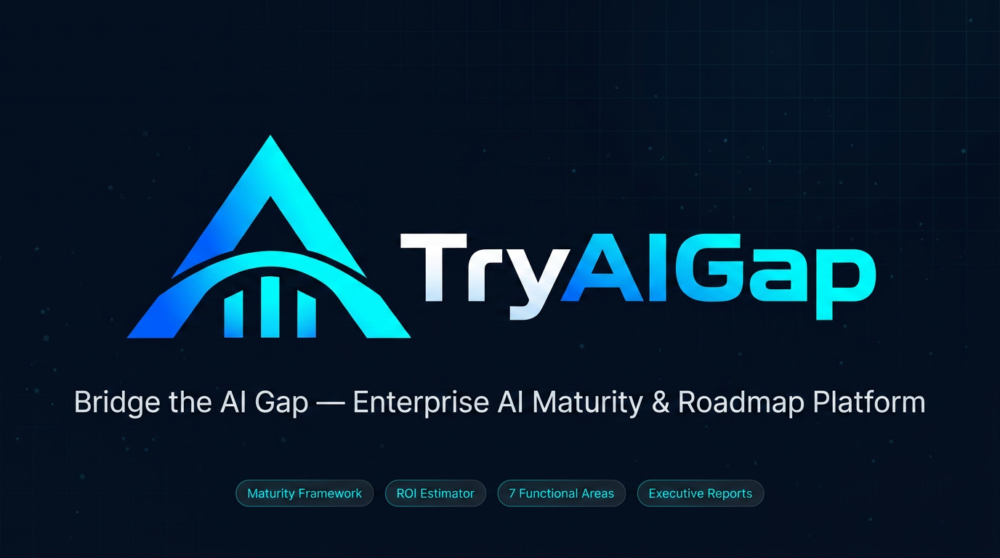

# Capstone 003D — TryAI Gap

Portafolio de Título · Duoc UC · Semestre 2 2026

## Estructura del repositorio

```text
├── Fase 1/                ← Definición Proyecto APT (semanas 1-4)
├── Fase 2/                ← Desarrollo del Proyecto APT (semanas 5-15)
├── Fase 3/                ← Presentación del Proyecto APT (semanas 16-18)
├── TryAIGap/              ← Código y documentación del proyecto
│   ├── backend/           ← Backend API (FastAPI, SQLAlchemy async, auth y scoring 5D)
│   │   ├── app/           ← Endpoints REST (v1), modelos, esquemas y lógica de negocio
│   │   └── migrations/    ← Control de versiones y esquemas de BD (Alembic)
│   ├── web/               ← Frontend SPA (React 19, TypeScript, Vite, Tailwind, shadcn/ui)
│   │   ├── src/           ← Vistas, componentes accesibles, estado (Zustand) y reportes PDF
│   │   └── public/        ← Assets estáticos, brand assets (banner, logos) y locales i18n
│   ├── Spanish/           ← Banco de preguntas y matrices de madurez en Español (Excel)
│   ├── English/           ← Banco de preguntas y matrices de madurez en Inglés (Excel)
│   └── wireframe-v2.html  ← Prototipo interactivo de referencia técnica
└── Material adicional/    ← PDFs de referencia del curso
```